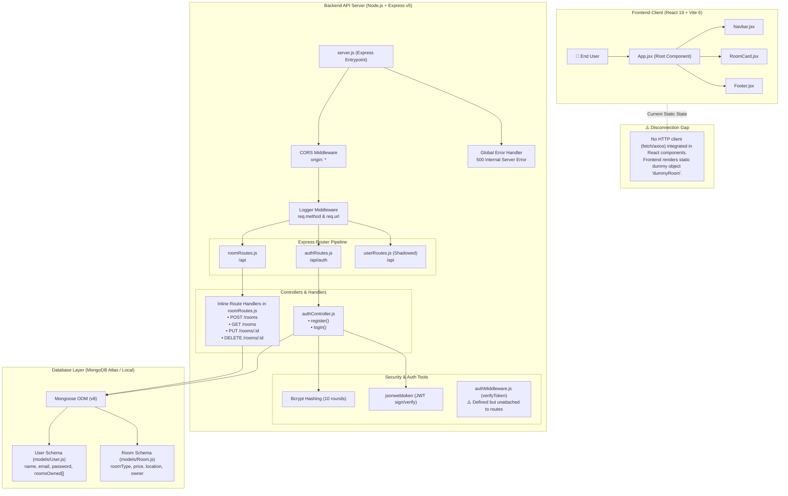
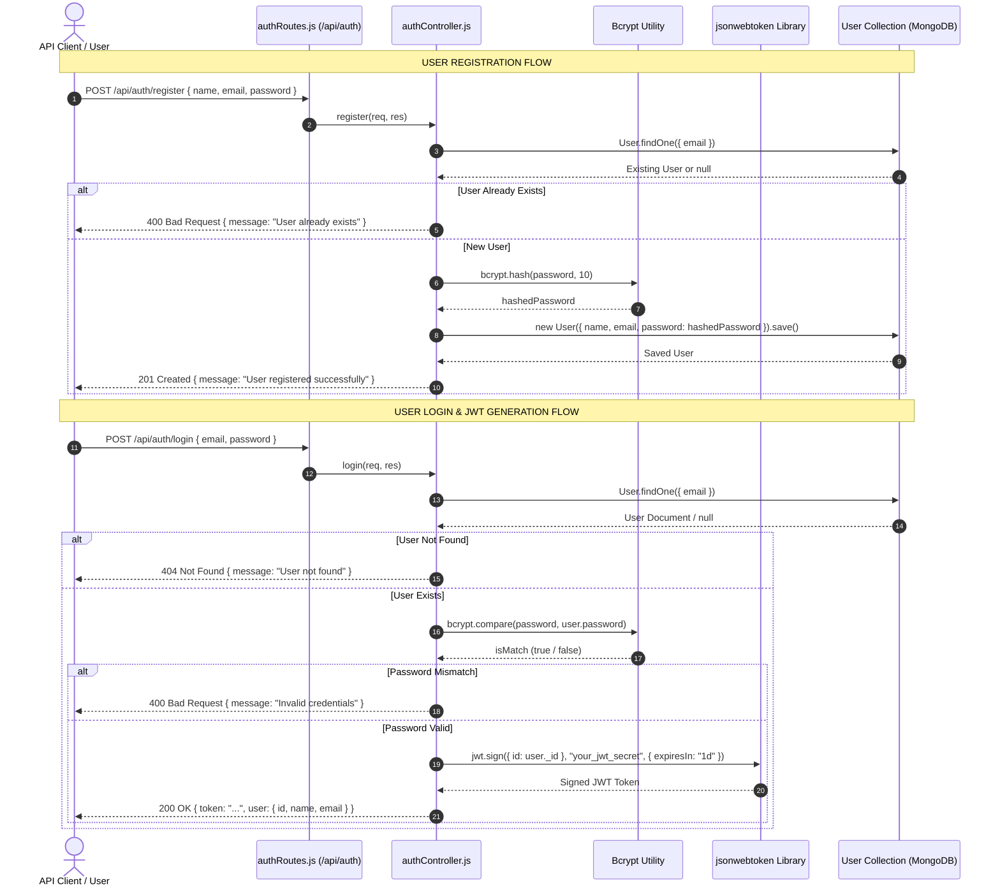
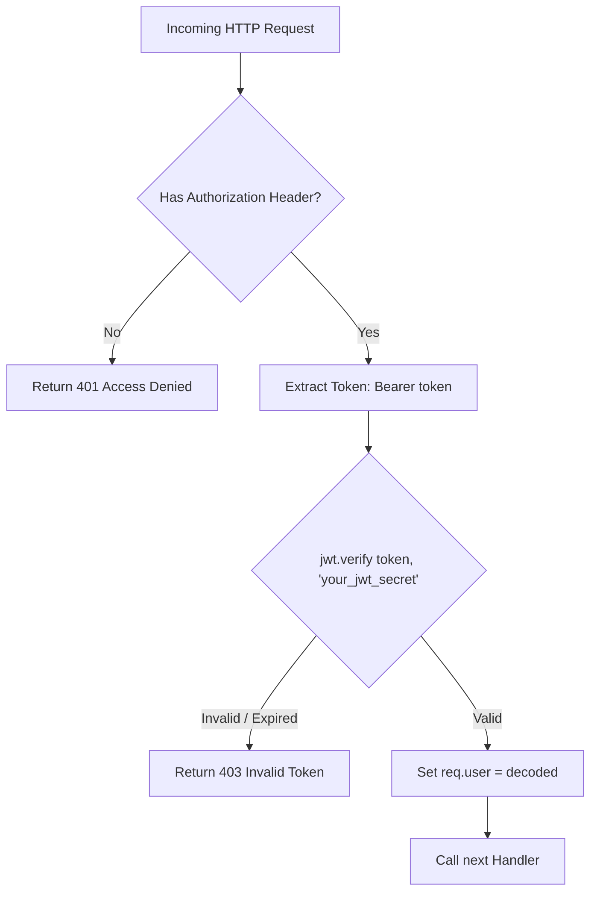

# Architecture and Data-Flow Documentation

> **Project:** Accommodation Finder (`S63_Ankit_Capstone_AccommodationFinder`)  
> **Document Type:** Architectural & System Data-Flow Specification  
> **Verification Basis:** Grounded strictly in active repository source code.

---

## 1. System Architecture Overview

The application follows a decoupled client-server architecture consisting of a **React Single-Page Application (SPA)** frontend and a **Node.js/Express REST API** backend connected to a **MongoDB** document store.

### High-Level System Architecture Diagram



---

## 2. API Data-Flow Diagrams

### A. Room Listing Data-Flow (CRUD Pipeline)

```mermaid
sequenceDiagram
    autonumber
    actor Client as API Client / Postman / Bruno
    participant Server as Express (server.js)
    participant RoomRoutes as roomRoutes.js (/api)
    participant Mongoose as Mongoose Models
    participant MongoDB as MongoDB Database

    Note over Client,MongoDB: 1. CREATE ROOM LISTING (POST /api/rooms)
    Client->>Server: POST /api/rooms { roomType, price, location, userId }
    Server->>RoomRoutes: Route matching /api/rooms
    RoomRoutes->>Mongoose: User.findById(userId)
    Mongoose->>MongoDB: db.users.findOne({ _id: userId })
    MongoDB-->>Mongoose: User Document
    alt User Not Found
        Mongoose-->>RoomRoutes: null
        RoomRoutes-->>Client: 404 { message: "User not found" }
    else User Exists
        RoomRoutes->>Mongoose: new Room({ roomType, price, location, owner: userId }).save()
        Mongoose->>MongoDB: db.rooms.insertOne(...)
        MongoDB-->>Mongoose: Saved Room Document
        RoomRoutes->>Mongoose: user.roomsOwned.push(savedRoom._id); user.save()
        Mongoose->>MongoDB: db.users.updateOne(...)
        RoomRoutes-->>Client: 201 Created (Saved Room Object)
    end

    Note over Client,MongoDB: 2. READ ALL ROOMS (GET /api/rooms)
    Client->>Server: GET /api/rooms
    Server->>RoomRoutes: Route matching /api/rooms
    RoomRoutes->>Mongoose: Room.find().populate("owner", "name email")
    Mongoose->>MongoDB: db.rooms.find() + db.users.find({ _id: { $in: ownerIds } })
    MongoDB-->>Mongoose: Array of Room Documents with Owner details
    RoomRoutes-->>Client: 200 OK [ { _id, roomType, price, location, owner: { _id, name, email } } ]

    Note over Client,MongoDB: 3. UPDATE ROOM (PUT /api/rooms/:id)
    Client->>Server: PUT /api/rooms/:id { price: 8500 }
    Server->>RoomRoutes: Route matching /api/rooms/:id
    RoomRoutes->>Mongoose: Room.findByIdAndUpdate(id, body, { new: true })
    Mongoose->>MongoDB: db.rooms.findOneAndUpdate(...)
    MongoDB-->>Mongoose: Updated Room Document
    RoomRoutes-->>Client: 200 OK (Updated Room Object)

    Note over Client,MongoDB: 4. DELETE ROOM (DELETE /api/rooms/:id)
    Client->>Server: DELETE /api/rooms/:id
    Server->>RoomRoutes: Route matching /api/rooms/:id
    RoomRoutes->>Mongoose: Room.findByIdAndDelete(id)
    Mongoose->>MongoDB: db.rooms.findOneAndDelete(...)
    MongoDB-->>Mongoose: Deleted Room Document
    RoomRoutes->>Mongoose: User.findByIdAndUpdate(room.owner, { $pull: { roomsOwned: room._id } })
    Mongoose->>MongoDB: db.users.updateOne(...)
    RoomRoutes-->>Client: 200 OK { message: "Room deleted successfully" }
```

---

## 3. Authentication & JWT Token Flow



### Potential Protected Route Flow (Middleware Architecture)

Below is the execution model of `middleware/authMiddleware.js` (`verifyToken`). *Note: This middleware exists in the codebase but is not currently attached to Express routes.*



---

## 4. Explanation of Major Components

### 1. Frontend Client (`Frontend/client`)
- **Framework & Libraries:** Built with **React 19**, bundled using **Vite 6**, and styled with **Tailwind CSS v4** and **Radix UI Avatar**.
- **Root Component (`App.jsx`):** Renders a static page prototype combining `<Navbar />`, `<RoomCard room={dummyRoom} />`, and `<Footer />`.
- **Component Breakdown:**
  - `Navbar.jsx`: Displays top navigation links (`Home`, `Rooms`, `About`).
  - `RoomCard.jsx`: Accepts a `room` prop displaying title, description, and rent.
  - `Footer.jsx`: Renders copyright text.
  - `Header.jsx` & `AccommodationList.jsx`: Present in directory as empty 0-byte placeholder files.

### 2. Backend Application Server (`Backend/server.js`)
- **Runtime:** Node.js running **Express v5**.
- **Global Middlewares:**
  - `cors`: Allows all origins (`*`) and methods (`GET`, `POST`, `PUT`, `DELETE`).
  - `express.json()`: Parses incoming JSON bodies.
  - Custom Request Logger: Logs `[ISO Timestamp] METHOD URL` to stdout.
  - Global Error Handler: Catches uncaught runtime errors and responds with status 500 `{ error: "Internal Server Error" }`.

### 3. API Routes & Routing Table
- **/api/auth (`routes/authRoutes.js`):** Routes requests to `authController.js`.
  - `POST /register`
  - `POST /login`
- **/api (`routes/roomRoutes.js`):** Contains inline handlers for room and user management.
  - `POST /rooms`
  - `GET /rooms`
  - `PUT /rooms/:id`
  - `DELETE /rooms/:id`
  - `POST /users` (Testing route to create user)
  - `GET /users` (Testing route to fetch users with populated rooms)
- **/api (`routes/userRoutes.js`):** Contains `POST /users` and `GET /users`. *(Note: Shadowed by `roomRoutes.js` because `roomRoutes` is mounted first in `server.js`).*

### 4. Controller Layer
- **`authController.js`:** Manages user creation with password hashing via `bcrypt` (10 salt rounds) and authentication issuing a JWT token expiring in 1 day.
- **`roomController.js`:** Contains standalone exported functions (`createRoom`, `getAllRooms`). *(Note: Not imported or used by `roomRoutes.js`).*

### 5. Authentication & Security Layer
- **Password Hashing:** `bcrypt` / `bcryptjs`.
- **Token Manager:** `jsonwebtoken` signs tokens containing user ID `{ id: user._id }`.
- **`authMiddleware.js`:** Implements `verifyToken` middleware that validates `Authorization: Bearer <token>` headers against `"your_jwt_secret"`.

### 6. Database Layer (`Backend/models`)
- **Engine:** MongoDB via Mongoose v8.
- **`User` Model:**
  - `name`: String (required)
  - `email`: String (required, unique)
  - `password`: String (required, minlength 6)
  - `roomsOwned`: Array of `Room` ObjectIds (ref: `'Room'`)
- **`Room` Model:**
  - `roomType`: String (required)
  - `price`: Number (required)
  - `location`: String (required)
  - `owner`: `User` ObjectId (ref: `'User'`)

---

## 5. Request & Data Flow Explanation

1. **Client Interaction:** An external client (e.g. Postman, cURL, or future React fetch calls) dispatches an HTTP request to `http://localhost:5001`.
2. **Server Middleware Pipeline:** `server.js` processes CORS policies, parses JSON request bodies, logs the request metadata, and routes the path to the designated router.
3. **Route Dispatching:**
   - Auth requests under `/api/auth` are dispatched to `authController.js`.
   - Room and user requests under `/api` are handled by inline handlers in `roomRoutes.js`.
4. **Data Persistence:**
   - Handlers communicate with MongoDB via Mongoose schema models (`User` and `Room`).
   - Relational bidirectional linking occurs upon room creation (`user.roomsOwned.push(savedRoom._id)`) and room deletion (`User.findByIdAndUpdate(room.owner, { $pull: { roomsOwned: room._id } })`).
5. **Response Delivery:** The server returns structured JSON responses along with appropriate HTTP status codes (`200 OK`, `201 Created`, `400 Bad Request`, `404 Not Found`, `500 Internal Server Error`).

---

## 6. Architectural Observations & Unverified Components

The following findings represent actual code states verified during analysis:

| Component / Claim | Status in Codebase | Empirical Finding |
| :--- | :--- | :--- |
| **Frontend HTTP Requests** | ❌ Not Implemented | Zero `fetch`/`axios` calls exist in `Frontend/client/src/`. React UI displays static `dummyRoom`. |
| **Route Security Integration** | ⚠️ Unattached | `authMiddleware.js` (`verifyToken`) is defined but not imported or attached to any route in `roomRoutes.js`. |
| **`roomController.js` Linkage** | ⚠️ Unlinked | `controllers/roomController.js` functions are unlinked; `routes/roomRoutes.js` uses inline handler functions. |
| **Route Redundancy** | ⚠️ Shadowed | Both `roomRoutes.js` and `userRoutes.js` define `POST /users` and `GET /users`. `roomRoutes.js` handles them due to mounting order in `server.js`. |
| **Google / Social OAuth** | ❌ Not Implemented | No OAuth libraries, SDKs, or routes exist in code. Auth is strictly local email/password JWT. |
| **File / Image Uploads** | ❌ Not Implemented | No file upload middleware (e.g., `multer`) or cloud storage SDKs exist in backend or frontend code. |
| **Client-Side Routing** | ❌ Not Implemented | `react-router-dom` is not installed; navigation in `Navbar.jsx` uses standard HTML `<a>` tags. |
