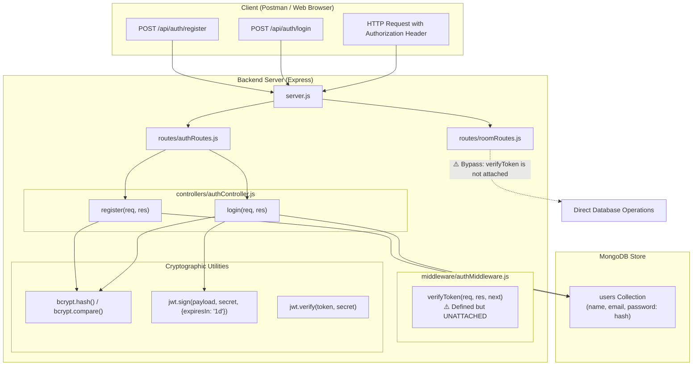
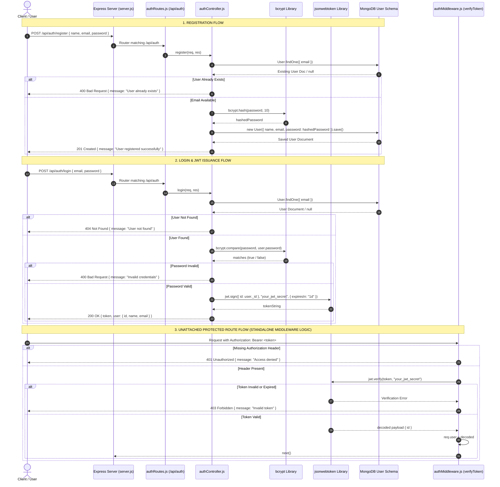

# Authentication Implementation & Security Flow Analysis

> **Project:** Accommodation Finder (`S63_Ankit_Capstone_AccommodationFinder`)  
> **Document Type:** Technical Security Audit & Authentication Flow Specification  
> **Verification Basis:** Grounded strictly in active repository source code.

---

## 1. Authentication Architecture Overview

The backend authentication subsystem is built using Node.js, Express v5, MongoDB (Mongoose v8), `bcryptjs`/`bcrypt`, and `jsonwebtoken`.

### Authentication Architecture Diagram



---

## 2. End-to-End Sequence Diagram



---

## 3. Detailed Flow Breakdown & Source References

### A. User Registration Flow
- **Endpoint:** `POST /api/auth/register`
- **Route Reference:** [`Backend/routes/authRoutes.js:5`](file:///Users/manghnaniankit/Desktop/S63_Ankit_Capstone_AccommodationFinder/Backend/routes/authRoutes.js#L5)
- **Controller Implementation:** [`Backend/controllers/authController.js:5-21`](file:///Users/manghnaniankit/Desktop/S63_Ankit_Capstone_AccommodationFinder/Backend/controllers/authController.js#L5-L21)
- **Execution Steps:**
  1. Destructures `name`, `email`, and `password` from `req.body`.
  2. Queries MongoDB via `User.findOne({ email })` to enforce uniqueness.
  3. If user exists, returns HTTP 400 `{ message: "User already exists" }`.
  4. Generates a salt and hashes the plaintext password using `bcrypt.hash(password, 10)`.
  5. Instantiates a new `User` document with `name`, `email`, and `password: hashedPassword`.
  6. Saves the document to MongoDB and responds with HTTP 201 `{ message: "User registered successfully" }`.

### B. User Login & Token Generation Flow
- **Endpoint:** `POST /api/auth/login`
- **Route Reference:** [`Backend/routes/authRoutes.js:6`](file:///Users/manghnaniankit/Desktop/S63_Ankit_Capstone_AccommodationFinder/Backend/routes/authRoutes.js#L6)
- **Controller Implementation:** [`Backend/controllers/authController.js:23-39`](file:///Users/manghnaniankit/Desktop/S63_Ankit_Capstone_AccommodationFinder/Backend/controllers/authController.js#L23-L39)
- **Execution Steps:**
  1. Destructures `email` and `password` from `req.body`.
  2. Queries MongoDB via `User.findOne({ email })`.
  3. If no user record exists, returns HTTP 404 `{ message: "User not found" }`.
  4. Compares plaintext input password with stored hash via `bcrypt.compare(password, user.password)`.
  5. If password comparison fails, returns HTTP 400 `{ message: "Invalid credentials" }`.
  6. If comparison succeeds, signs a JWT using `jwt.sign({ id: user._id }, "your_jwt_secret", { expiresIn: "1d" })`.
  7. Returns HTTP 200 `{ token, user: { id: user._id, name: user.name, email: user.email } }`.

### C. Google OAuth Flow
- **Status:** ❌ **Not Implemented**
- **Verification:** No Passport.js, Google OAuth 2.0 SDKs, client IDs, or OAuth redirect routes exist in the codebase.

### D. Token Lifecycle & Storage
- **Token Structure:** Signed JWT containing payload `{ id: user._id }`.
- **Token Expiration:** Hardcoded to `1d` (1 day).
- **Client Storage:** Currently not handled by the React frontend (`App.jsx` renders local static state; no `localStorage`/`sessionStorage`/HTTP-only cookie logic is present).

### E. Authentication Middleware (`verifyToken`)
- **File Reference:** [`Backend/middleware/authMiddleware.js:3-15`](file:///Users/manghnaniankit/Desktop/S63_Ankit_Capstone_AccommodationFinder/Backend/middleware/authMiddleware.js#L3-L15)
- **Implementation:**
  ```javascript
  const verifyToken = (req, res, next) => {
    const token = req.headers.authorization?.split(" ")[1];
    if (!token) return res.status(401).json({ message: "Access denied" });
    try {
      const decoded = jwt.verify(token, "your_jwt_secret");
      req.user = decoded;
      next();
    } catch (err) {
      res.status(403).json({ message: "Invalid token" });
    }
  };
  ```
- **Status:** ⚠️ **Defined but Unattached**. The `verifyToken` function is exported but never imported or attached to any endpoint in `roomRoutes.js`, `userRoutes.js`, or `server.js`.

### F. Protected Routes
- **Status:** ⚠️ **Unprotected API Endpoints**.
- All room CRUD operations (`GET /api/rooms`, `POST /api/rooms`, `PUT /api/rooms/:id`, `DELETE /api/rooms/:id`) can be executed without presenting a JWT token.

### G. Logout Flow
- **Status:** ❌ **Not Implemented**
- No token blacklisting, session destruction, or logout endpoints exist in the backend API.

---

## 4. Observable Security Vulnerabilities & Technical Weaknesses

1. **Hardcoded Secret Key:**
   - Both [`authController.js:33`](file:///Users/manghnaniankit/Desktop/S63_Ankit_Capstone_AccommodationFinder/Backend/controllers/authController.js#L33) and [`authMiddleware.js:9`](file:///Users/manghnaniankit/Desktop/S63_Ankit_Capstone_AccommodationFinder/Backend/middleware/authMiddleware.js#L9) use the hardcoded string `"your_jwt_secret"` instead of loading `process.env.JWT_SECRET`.
2. **Unenforced Authentication on API Endpoints:**
   - Room mutation routes (`POST /rooms`, `PUT /rooms/:id`, `DELETE /rooms/:id`) in [`roomRoutes.js`](file:///Users/manghnaniankit/Desktop/S63_Ankit_Capstone_AccommodationFinder/Backend/routes/roomRoutes.js) do not utilize `verifyToken`. Anyone can create, modify, or delete room listings.
3. **Insecure User Attribution:**
   - In `POST /api/rooms` ([`roomRoutes.js:31`](file:///Users/manghnaniankit/Desktop/S63_Ankit_Capstone_AccommodationFinder/Backend/routes/roomRoutes.js#L31)), the owning user ID (`userId`) is read directly from `req.body` rather than from verified token claims (`req.user.id`).
4. **Lack of Rate Limiting & Brute-Force Protection:**
   - Authentication endpoints (`POST /api/auth/login`) lack rate limiting, exposing login routes to automated dictionary/brute-force attacks.
5. **No Password Complexity Validation:**
   - User schema ([`User.js:16`](file:///Users/manghnaniankit/Desktop/S63_Ankit_Capstone_AccommodationFinder/Backend/models/User.js#L16)) enforces `minlength: 6` but does not enforce password complexity (numbers, symbols, uppercase letters).
6. **Frontend Auth Disconnection:**
   - The React client in `Frontend/client` does not store, send, or handle JWT tokens or login state.
