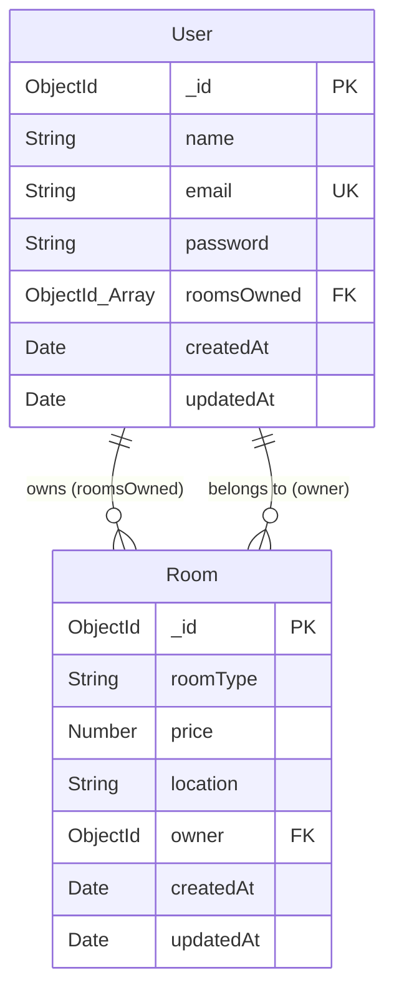

# Database Schema & Architecture Documentation

This document provides a comprehensive, production-grade reconstruction of the actual MongoDB database schema implemented via Mongoose in this repository.

---

## Architecture Summary

- **Database Engine & ORM**: MongoDB with Mongoose (`^8.13.2`) as the Object Data Modeling (ODM) library.
- **Data Models**: Two primary models defined: `User` ([User.js](file:///Users/manghnaniankit/Desktop/S63_Ankit_Capstone_AccommodationFinder/Backend/models/User.js)) and `Room` ([Room.js](file:///Users/manghnaniankit/Desktop/S63_Ankit_Capstone_AccommodationFinder/Backend/models/Room.js)).
- **Collection Naming**: Automatic Mongoose collection pluralization yields `users` and `rooms` collections.
- **Relationship Type**: Bi-directional 1-to-N (One-to-Many) relationship between `User` and `Room` using Mongoose `ObjectId` references (`User.roomsOwned` $\rightarrow$ `[Room]` and `Room.owner` $\rightarrow$ `User`).
- **Timestamping**: Both models leverage automatic Mongoose timestamp generation (`{ timestamps: true }`), automatically creating and updating `createdAt` and `updatedAt` Date fields.
- **Indexing**: A single explicit unique index exists on `User.email`. Standard default `_id` indexes exist on both collections.
- **Data Persistence Strategy**: Document-based relational linking using Mongoose population (`.populate()`) rather than embedded subdocuments.

---

## Detailed Model Schemas

### 1. User Model

- **Model Name**: `User`
- **Collection**: `users`
- **Source File**: [`Backend/models/User.js`](file:///Users/manghnaniankit/Desktop/S63_Ankit_Capstone_AccommodationFinder/Backend/models/User.js)

| Model | Collection | Field | Type | Required | Default | Reference | Validation | Description |
| :--- | :--- | :--- | :--- | :--- | :--- | :--- | :--- | :--- |
| `User` | `users` | `_id` | `ObjectId` | Yes (Auto) | `ObjectId()` | N/A | Primary Key | Unique document identifier automatically generated by MongoDB. |
| `User` | `users` | `name` | `String` | Yes | None | N/A | `required: true` | Full name of the user. |
| `User` | `users` | `email` | `String` | Yes | None | N/A | `required: true`, `unique: true` | User email address. Enforces unique index in MongoDB. |
| `User` | `users` | `password` | `String` | Yes | None | N/A | `required: true`, `minlength: 6` | Password string (stored as bcrypt hash in controller). |
| `User` | `users` | `roomsOwned` | `Array<ObjectId>` | No | `[]` | `Room` (`ref: 'Room'`) | Array of `ObjectId` | Array of references pointing to `Room` documents owned by the user. |
| `User` | `users` | `createdAt` | `Date` | Yes (Auto) | `Date.now` | N/A | Mongoose Timestamps | Timestamp indicating when the user document was created. |
| `User` | `users` | `updatedAt` | `Date` | Yes (Auto) | `Date.now` | N/A | Mongoose Timestamps | Timestamp indicating when the user document was last modified. |

---

### 2. Room Model

- **Model Name**: `Room`
- **Collection**: `rooms`
- **Source File**: [`Backend/models/Room.js`](file:///Users/manghnaniankit/Desktop/S63_Ankit_Capstone_AccommodationFinder/Backend/models/Room.js)

| Model | Collection | Field | Type | Required | Default | Reference | Validation | Description |
| :--- | :--- | :--- | :--- | :--- | :--- | :--- | :--- | :--- |
| `Room` | `rooms` | `_id` | `ObjectId` | Yes (Auto) | `ObjectId()` | N/A | Primary Key | Unique document identifier automatically generated by MongoDB. |
| `Room` | `rooms` | `roomType` | `String` | Yes | None | N/A | `required: true` | Category or description of the room (e.g. Single, Double). |
| `Room` | `rooms` | `price` | `Number` | Yes | None | N/A | `required: true` | Rental price for the accommodation unit. |
| `Room` | `rooms` | `location` | `String` | Yes | None | N/A | `required: true` | Geographic location or address of the room. |
| `Room` | `rooms` | `owner` | `ObjectId` | No | None | `User` (`ref: 'User'`) | `ObjectId` | Foreign key reference pointing to the `User` who owns the room. |
| `Room` | `rooms` | `createdAt` | `Date` | Yes (Auto) | `Date.now` | N/A | Mongoose Timestamps | Timestamp indicating when the room document was created. |
| `Room` | `rooms` | `updatedAt` | `Date` | Yes (Auto) | `Date.now` | N/A | Mongoose Timestamps | Timestamp indicating when the room document was last modified. |

---

## Entity-Relationship Diagram (ERD)

The diagram below represents the actual verified relationships defined in the schema and maintained across route handlers:



### Relationship Mechanics
1. **`User` $\rightarrow$ `Room` (1-to-N)**: A single `User` document stores an array of `Room` `ObjectId`s in `roomsOwned`.
2. **`Room` $\rightarrow$ `User` (N-to-1)**: A `Room` document stores a single `User` `ObjectId` in `owner`.
3. **Cascading Sync**: In [`Backend/routes/roomRoutes.js`](file:///Users/manghnaniankit/Desktop/S63_Ankit_Capstone_AccommodationFinder/Backend/routes/roomRoutes.js), creating a room updates `User.roomsOwned` via `.push()`, and deleting a room cleans up `User.roomsOwned` via `$pull`.

---

## Model Usage in Application Routes & Controllers

| Model | Active Status | File Context | Usage Details |
| :--- | :--- | :--- | :--- |
| **`User`** | **Active** | [`controllers/authController.js`](file:///Users/manghnaniankit/Desktop/S63_Ankit_Capstone_AccommodationFinder/Backend/controllers/authController.js) | `User.findOne({ email })` for auth, `newUser.save()` on register. |
| **`User`** | **Active** | [`routes/roomRoutes.js`](file:///Users/manghnaniankit/Desktop/S63_Ankit_Capstone_AccommodationFinder/Backend/routes/roomRoutes.js) | `User.find().populate("roomsOwned")`, `User.findById(userId)`, `User.findByIdAndUpdate(..., { $pull })`. |
| **`User`** | **Active** | [`routes/userRoutes.js`](file:///Users/manghnaniankit/Desktop/S63_Ankit_Capstone_AccommodationFinder/Backend/routes/userRoutes.js) | `new User(req.body).save()`, `User.find()`. |
| **`Room`** | **Active** | [`routes/roomRoutes.js`](file:///Users/manghnaniankit/Desktop/S63_Ankit_Capstone_AccommodationFinder/Backend/routes/roomRoutes.js) | `new Room(...).save()`, `Room.find().populate("owner")`, `Room.findByIdAndUpdate()`, `Room.findByIdAndDelete()`. |
| **`Room`** | **Unused Controller** | [`controllers/roomController.js`](file:///Users/manghnaniankit/Desktop/S63_Ankit_Capstone_AccommodationFinder/Backend/controllers/roomController.js) | **Dead Code**: `createRoom` and `getAllRooms` are defined here but are never imported or called in routes/server. |

---

## Schema & Application Code Inconsistencies

1. **Schema Validation Failure on Direct User Endpoint (`POST /api/users`)**:
   - In [`Backend/routes/roomRoutes.js`](file:///Users/manghnaniankit/Desktop/S63_Ankit_Capstone_AccommodationFinder/Backend/routes/roomRoutes.js#L7-L16), `POST /users` extracts `{ name, email }` from `req.body` and calls `new User({ name, email }).save()`.
   - Because `User` schema mandates `password` with `required: true`, any request to `POST /api/users` via `roomRoutes.js` will trigger a Mongoose `ValidationError`: `Path 'password' is required.`

2. **Route Shadowing / Route Conflict in `server.js`**:
   - In [`Backend/server.js`](file:///Users/manghnaniankit/Desktop/S63_Ankit_Capstone_AccommodationFinder/Backend/server.js#L29-L31), both `roomRoutes` and `userRoutes` are mounted at prefix `/api`:
     ```js
     app.use("/api", roomRoutes);
     app.use("/api", userRoutes);
     ```
   - Both router files declare `POST /users` and `GET /users`. Because `roomRoutes` is registered first, the endpoints defined inside [`Backend/routes/userRoutes.js`](file:///Users/manghnaniankit/Desktop/S63_Ankit_Capstone_AccommodationFinder/Backend/routes/userRoutes.js) are shadowed and unreachable.

3. **Bypassed Controller Pattern**:
   - [`Backend/controllers/roomController.js`](file:///Users/manghnaniankit/Desktop/S63_Ankit_Capstone_AccommodationFinder/Backend/controllers/roomController.js) defines standalone controller methods (`createRoom`, `getAllRooms`), but `roomRoutes.js` completely bypasses this module by writing inline controller logic inside route definitions.

4. **Hardcoded Secrets & Unenforced Authentication Middleware**:
   - [`authController.js`](file:///Users/manghnaniankit/Desktop/S63_Ankit_Capstone_AccommodationFinder/Backend/controllers/authController.js) and [`authMiddleware.js`](file:///Users/manghnaniankit/Desktop/S63_Ankit_Capstone_AccommodationFinder/Backend/middleware/authMiddleware.js) use hardcoded string `"your_jwt_secret"` instead of `process.env.JWT_SECRET`.
   - `authMiddleware` is not mounted on any room or user routes, allowing unauthenticated CRUD operations.

---

## Missing Validation Rules & Recommended Schema Enhancements

1. **`Room.price` Missing Minimum Value**:
   - Currently defined as `type: Number, required: true`. Lacks `min: [0, 'Price cannot be negative']`, which allows negative numbers to be persisted.
2. **`Room.roomType` Unrestricted String**:
   - Currently accepts any string without format validation or `enum` restrictions (e.g., `enum: ['Single', 'Double', 'Shared', 'Apartment', 'Studio']`).
3. **`User.email` Sanitization & Validation**:
   - Missing format regex validation (e.g. `match: [/^\S+@\S+\.\S+$/, 'Invalid email format']`) and normalization options (`lowercase: true`, `trim: true`).
4. **`Room.owner` Nullability**:
   - Marked as `required: false` in schema. If a room is created directly without a `userId`, it becomes orphaned without an owner.
